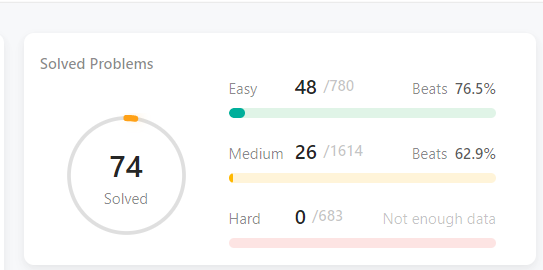

# problem_solving
 ## mentorship program :
 leetcode problems :
https://github.com/cs-MohamedAyman/Problem-Solving-Training

## my profile on Leetcode
https://leetcode.com/shehab162519/
## my  progress  from leetcode 
## week 1,2     total=60 
|               target                    |                 done                 |
|-----------------------------------------|--------------------------------------|
|Array I 10 questions                     |                14                    |                     
|Array II 10 questions                    |                3                     |                   
|Array IV 4 questions                     |                6                     |                    
|LinkedList 10 questions                  |                2                     |                    
|Stack 16 questions                       |                5                     |                    
|Queue and Dequeue 10 questions           |                1                     |
## week 3,4     total=45
|               target                    |                 done                 |
|-----------------------------------------|--------------------------------------|
|Recursion 5 questions                    |                6                     |                    
|Binary Tree 5 questions                  |                1                     |                    
|Heap Tree 5 questions                    |                0                     |                    
|Hash Table 10 questions                  |                6                     |                    
|Advanced Topices I 10 questions          |                0                     |                    
|Advanced Topices  II 10 questions        |                1                     | 
## week 5,6     total=50
|               target                    |                 done                 |
|-----------------------------------------|--------------------------------------|                
|Binary search  15 questions              |                                      |                 
|Sorting search 20  questions             |                                      |                 
|Greedy and Bit manipulation 15 questions |                                      |  
## week 7,8     total=40 
|               target                    |                 done                 |
|-----------------------------------------|--------------------------------------|
|Breath First search 10 questions         |                                      |                 
|Depth first Search 10 questions          |                                      |                 
|Graph 10 problems                        |                                      |                 
|Backtracing 10 questions                 |                                      | 
## week 9,10   total=60
|               target                    |                 done                 |
|-----------------------------------------|--------------------------------------|                
|interview 30 question I                  |                                      |                 
|interview 30 question II                 |                  1                   | 
## week 11,12 total=50
|               target                    |                 done                 |
|-----------------------------------------|--------------------------------------|
|Dynamic programing 20 question           |                                      |                 
|mathematics and string 30 problems       |                                      |                 